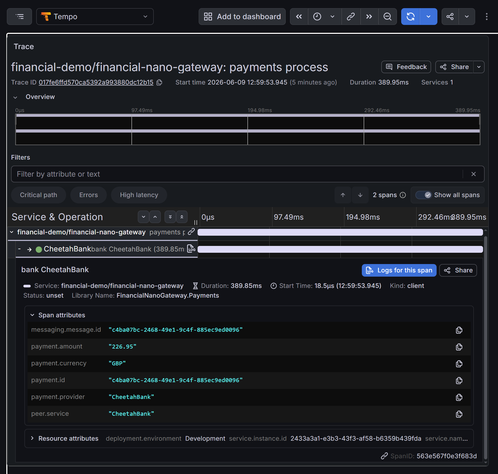
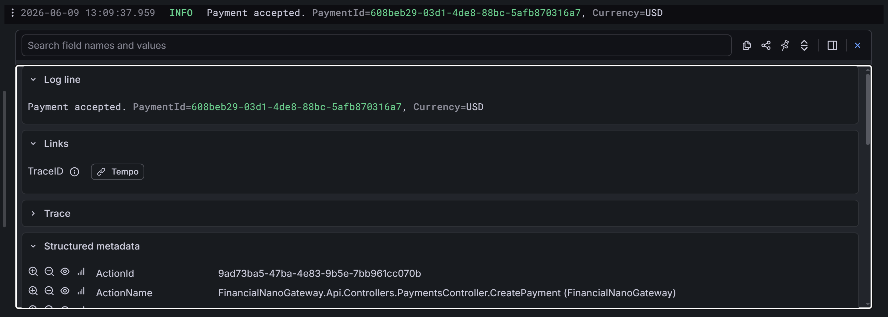
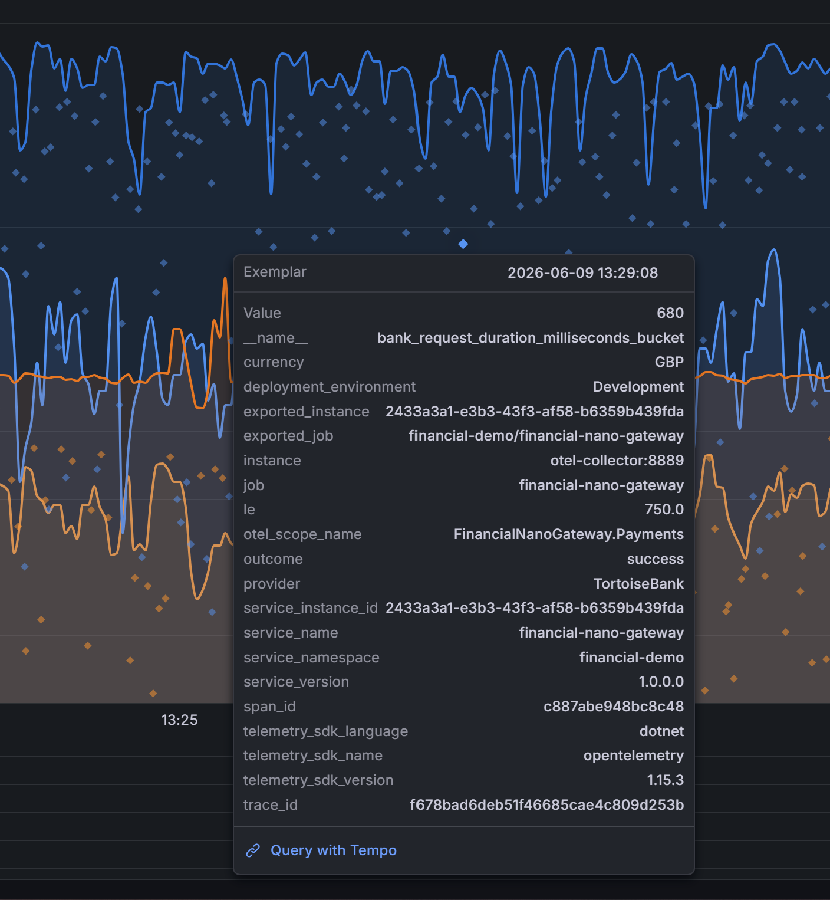
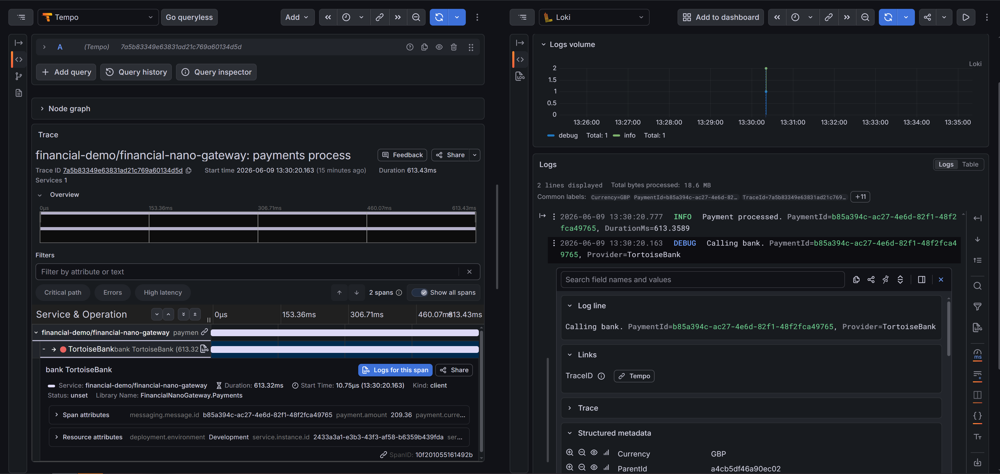
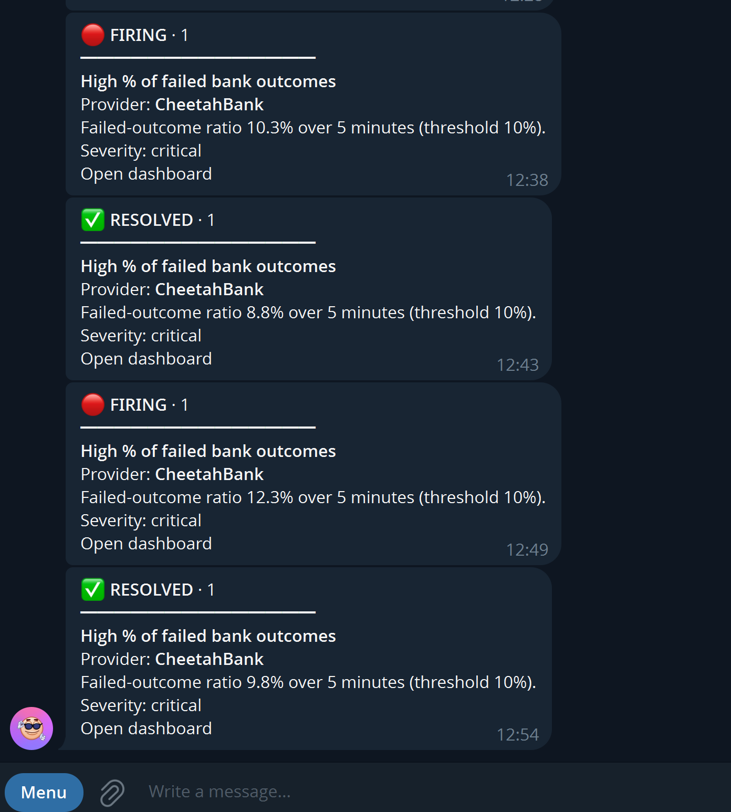
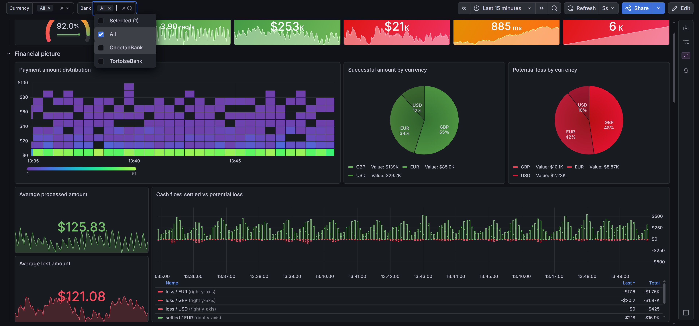
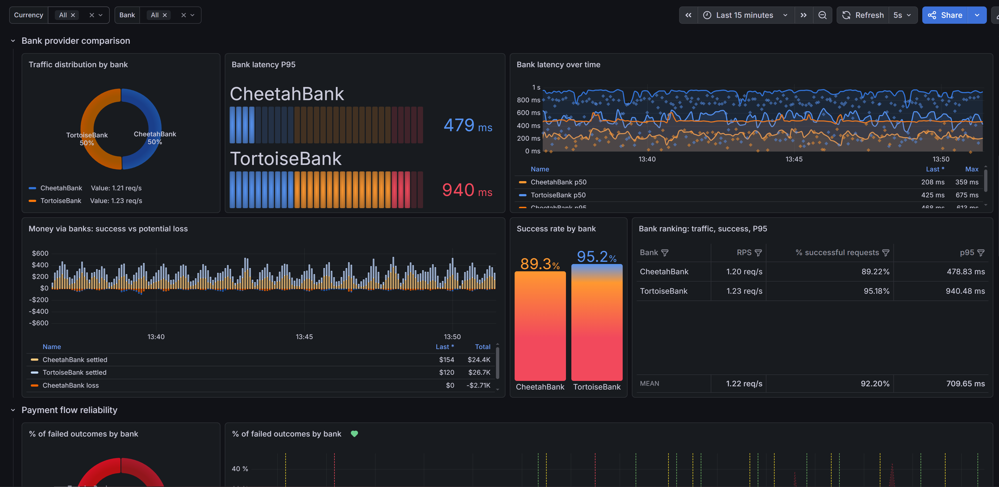
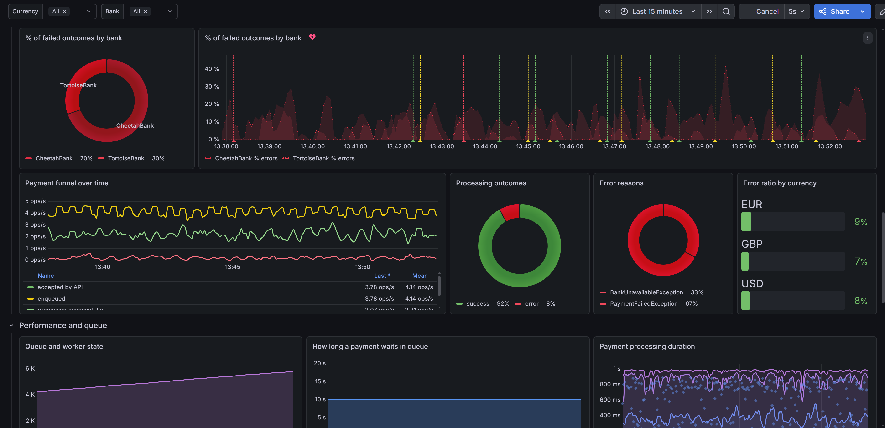
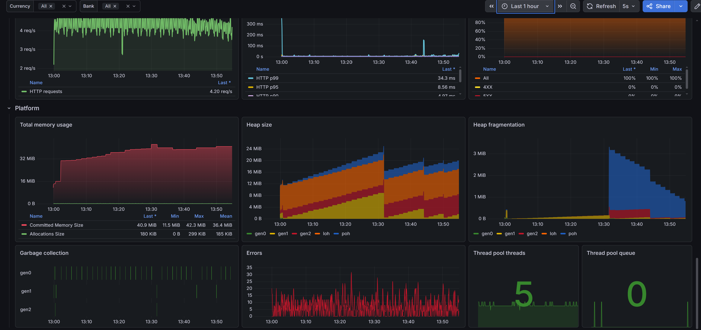

# Financial Nano-Gateway: Observability Demo

---

## Quick start

The project works out of the box. The infrastructure (Prometheus + Tempo + Loki + Grafana) is wired up via **provisioning**.

1. **Run:**
   ```bash
   docker-compose up -d

2. **Access the resources:**
* Swagger (API): http://localhost:8080/swagger
* Prometheus: http://localhost:9090
* Grafana: http://localhost:3000 (Login: admin / Password: 12345)

---

## Tech stack

*   **Runtime:** .NET 10 (ASP.NET Core)
*   **Observability:** OpenTelemetry (OTEL) SDK
*   **Storage:** Prometheus (metrics), Tempo (traces), Loki (logs)
*   **Visualization:** Grafana (Dashboards & Alerting)
*   **Infrastructure:** Docker Compose

---

## Architecture highlights

The project follows the **Explicit Metrics** principle - metrics are part of the application's contract, but their implementation is hidden behind abstractions.

*   **Clean Metrics:** The metric interfaces (`IPaymentMetrics`) live in the `Application` layer, while the `System.Diagnostics.Metrics`-based implementation lives in `Infrastructure.Observability`.
*   **High Performance:** The `TagList` struct is used to record tags. This guarantees **Zero Allocation** on hot paths (tags are kept on the stack), which is critical for fintech systems.
*   **Modern DI:** `IMeterFactory` is used to manage the lifecycle of meters correctly and to simplify testing.

---

## Monitoring data model

The project demonstrates the three fundamental metric types:

| Metric | Type | What it measures |
| :--- | :--- | :--- |
| `payment_processed_total` | **Counter** | Total count and volume of transactions (filterable by `currency`, `provider`, `status`). |
| `payment_processing_duration_ms` | **Histogram** | Percentiles (p95, p99) of processing time. Hunting for outliers and lags. |
| `payment_queue_depth` | **UpDownCounter** | Current number of payments in the queue. A backpressure / overload indicator. |


I tried to cover as many metric types and usage scenarios as possible. The important points are explained in code comments - what's worth paying attention to.

---

## Tracing (Distributed Tracing)

End-to-end tracing via **OpenTelemetry -> Tempo**. The key thing being demonstrated is stitching the two halves of a request across the async boundary: the HTTP request only puts the payment on a queue (`Channel`) and immediately returns `202`, while the actual processing happens later on a different thread.

The queue is treated as a message broker: the trace context (W3C `traceparent`) travels in the envelope headers, exactly as it would with Kafka/RabbitMQ. Following the messaging convention, the producer and consumer are separate traces joined by a **span link** (PRODUCER -> CONSUMER -> CLIENT). Unlike metrics, spans deliberately carry high-cardinality fields (`payment.id`, the exact amount) - a span is a single request, not an aggregate, and the more context per request, the faster the debugging. Errors are recorded right on the span - in Tempo that's a red span with a stack trace.



---

## Logs (Structured Logging)

Structured logs via `ILogger` -> **OpenTelemetry -> Loki**. They are written through source-generated `[LoggerMessage]` methods - the logging counterpart of the **Zero Allocation** story from the metrics. `BeginScope` mixes context (`PaymentId`) into all nested logs without passing it by hand.

The same cardinality discipline applies here: only low-cardinality fields (`service_name`) become Loki **labels**, while `trace_id` and `payment.id` go to **structured metadata**.



---

## Correlating the three pillars

The headline feature of the demo is jumping metric -> trace -> log in a couple of clicks:

*   **Metric -> trace:** histograms have **exemplars** enabled (points carrying a `trace_id`) - clicking one jumps straight into Tempo.
*   **Trace -> logs:** from a span, the "Logs for this span" button opens Loki filtered by `trace_id`.
*   **Log -> trace:** the `trace_id` field in a log is a clickable link back into Tempo.

So a "spike on the latency graph" unfolds in a couple of clicks into the specific failed payment and its log with the stack trace.




---

## Alerting

Alerts are configured as Infrastructure as Code. Grafana automatically picks up the rules from ./provisioning/alerting. There is an alert on the % of failed bank outcomes, delivered to Telegram through a custom, readable notification template (instead of the default field dump). The bot token is supplied via an environment variable (`.env`, git-ignored), not stored in the repo.



---

## Visualization (Grafana Dashboards)

Monitoring in the project is split into three logical levels, so the data is useful both to the business and to engineers:

### 1. Financial metrics
Focus on money flows and the success of business processes. They let you instantly gauge the product's "health" from a revenue perspective.



### 2. Operational metrics
Intended for monitoring external integrations and the quality of provider performance.




### 3. Technical metrics
Under-the-hood metrics of the application itself, needed for deep performance analysis and debugging.


